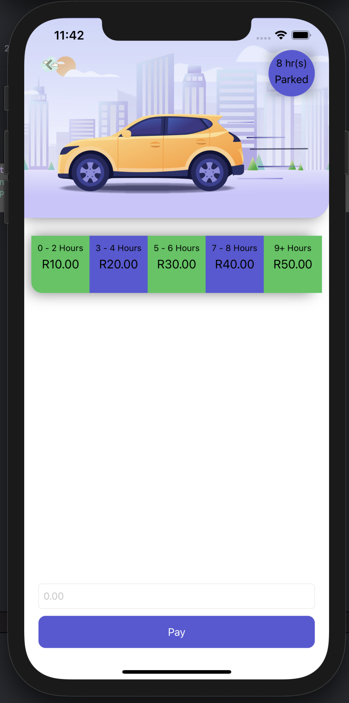
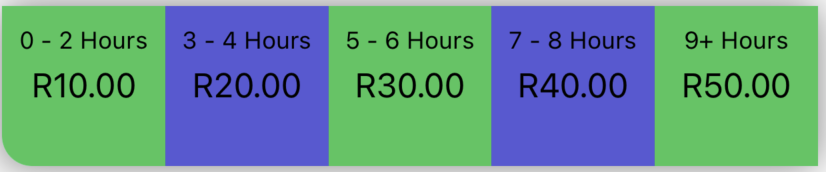
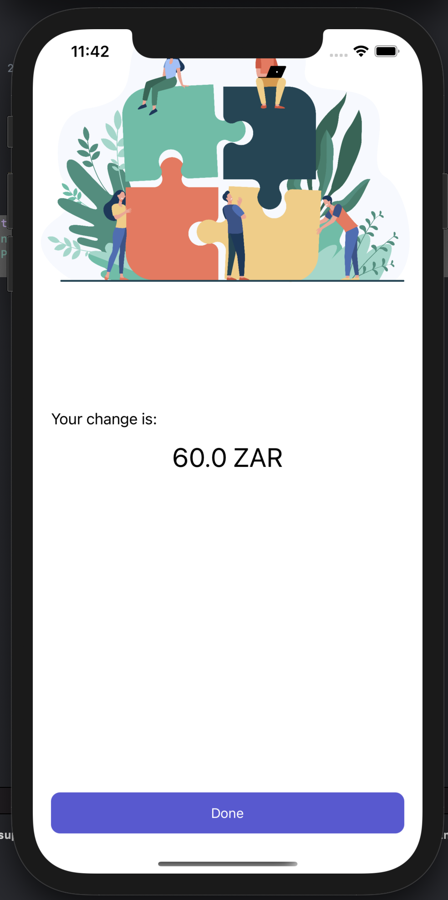

# Parking App

### asessment's required function 
#### Payment.swift


```
func processPayment(for amountPaying: Double, for amountDeducting: Double) throws -> String {
        ...
    }
```

processPayment method takes in 2 parameters, ```amountPaying``` which is the amount paid to parking and ```amountDeducting``` which is the amount to be deducted from the the amount(```amountPaying```) payed, it then subtracts the numbers and returns the change/remaining amount in ZAR(rands)

### Unit Tests
#### Testing Payment process
```
func testPayment() throws {
        
        XCTAssertEqual(try sut.processPayment(for: 50, for: 50), "\(0.0) ZAR", "Test passed, R50.0 - R50.0 is R0.0")
        XCTAssertEqual(try sut.processPayment(for: 50, for: 30), "\(20.0) ZAR", "Tessed passed, R50.0 - R30.0 is R20.0")
        XCTAssertThrowsError(try sut.processPayment(for: 0, for: 10)) // test passes, error thrown when amount paying is Zero and bellow
        XCTAssertThrowsError(try sut.processPayment(for: 30, for: 50))// test passes, error thrown when amount paying is less than the amount duducting
    }
```

### Error handling
#### PaymentError.swift

```
enum PaymentError: Error {
    case notEnoughFundsError
    case cannotBeZeroError
    case emptyFieldError
    case invalidValue
}
```

### Mock up data - faking data

#### MockUpData.swift

```
func fakeParkedHours() ->  Int {
        minutesParked = parkingMinutesArray[Int.random(in: 0..<(parkingMinutesArray.count - 1))]
        let parkingTime = minutesParked / 60
        return parkingTime
    }
```

An array subscript from ```parkingMinutesArray[]``` is chosen at random, this array contains made up minutes at which the fake vehicle has been parked, results from the ```fakeParkedHours()``` ia later used in ```PayForParkingViewControoler```to simulate parked time as to allow a demonstraion of paying for the parking

### Additional UI App functionality

#### PayForParkingViewController


Hour/time of parked is chosen at random and app allows user to pay for parking, the purple circle on the upper right of the shows how long the user has been parked


the image above shows the price to be paid for parking

#### PaymentSuccessViewController
